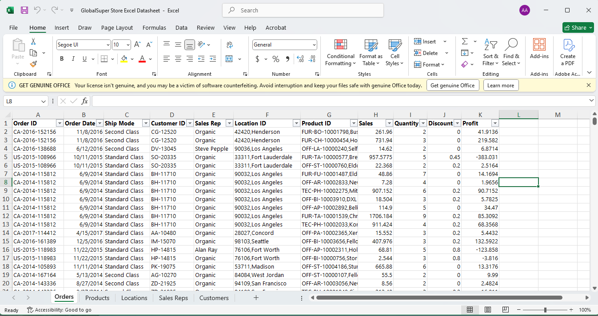
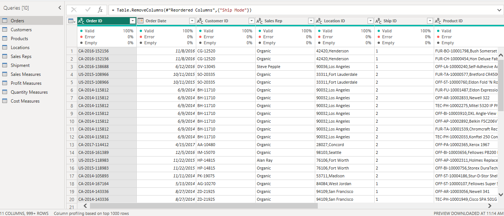
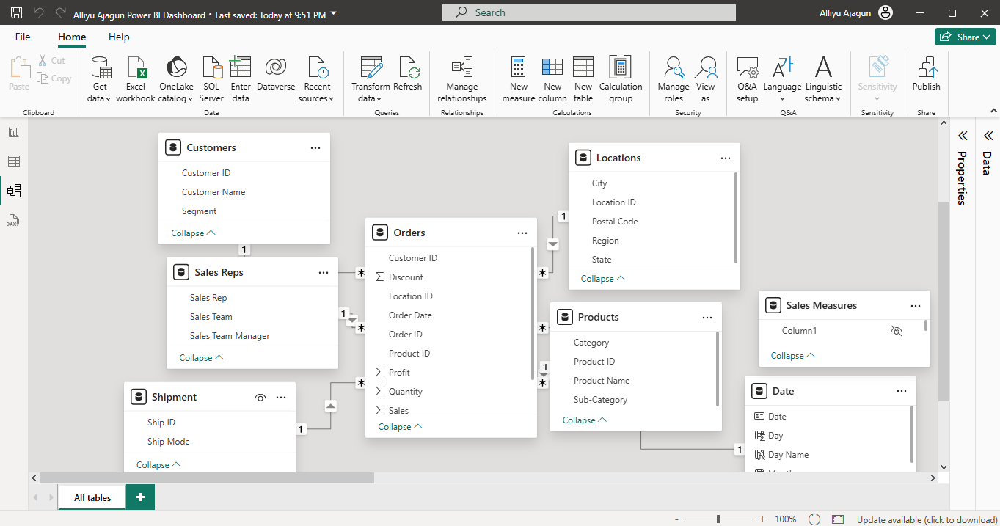
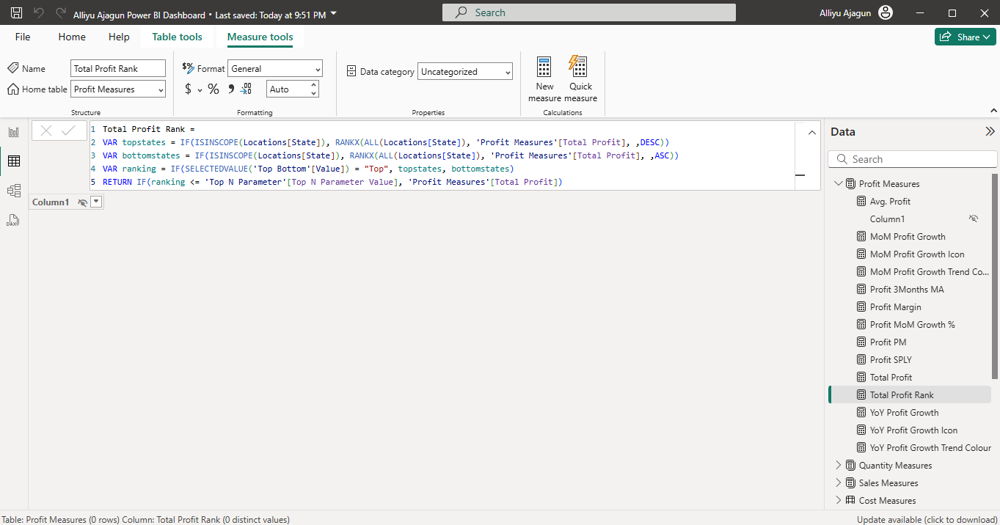
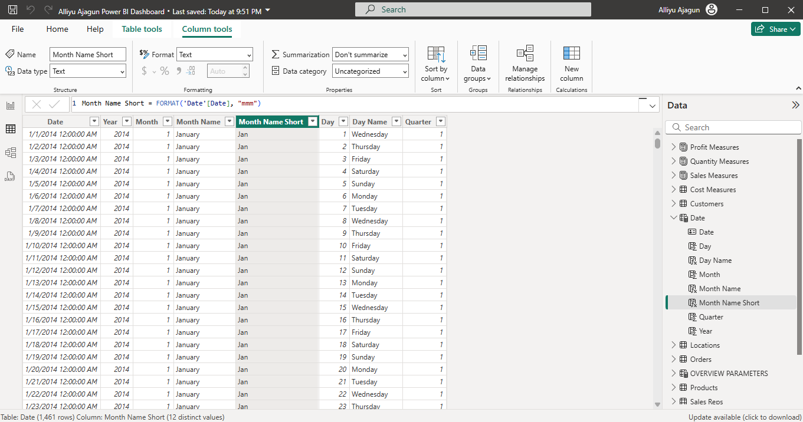
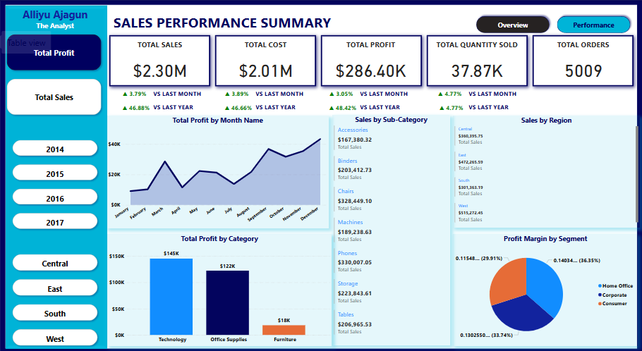
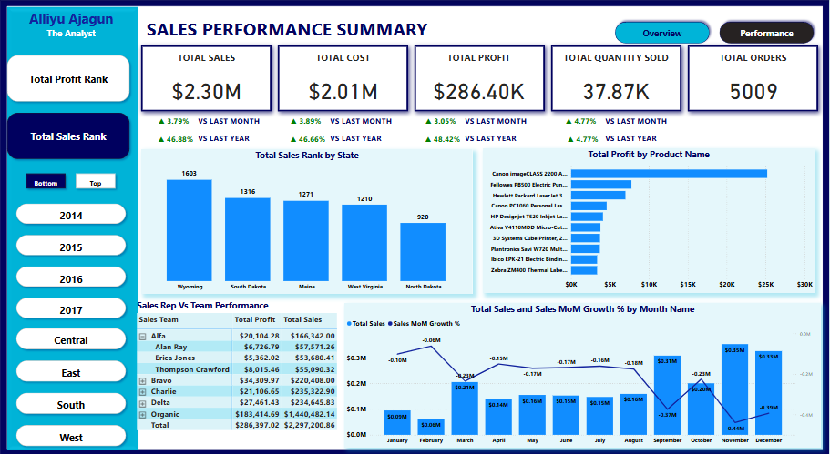
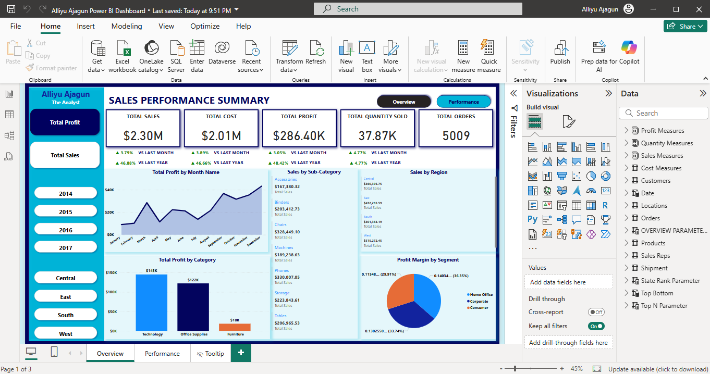

# Global-store-sales-performance
Interactive Power BI dashboard analyzing global retail sales performance (2014–2017) with insights on regions, products, and sales teams.

# Table of Contents
- [ Project Overview](#-project-overview)
- [ Project Goal](#-project-goal)
- [ Methodology](#-methodology)
- [ Data Visualization](#-data-visualization)
- [ Dataset](#-dataset)
- [ Dashboard](#-dashboard)
- [ Key Metrics](#-key-metrics)
- [ Trends and Insights](#-trends-and-insights)
- [ Recommendations](#-recommendations)
- [ Conclusion](#-conclusion)

#  Project Overview
## Title: Global Sales Performance Analysis (2014–2017)
This project explores a global store’s sales data from 2014 to 2017. Using Power BI, I built an interactive dashboard that analyzes total sales, profit, orders, product performance, regional distribution, and sales team efficiency.  
It identifies top-selling products, high-performing regions, underperforming categories, and uncovers trends to inform business strategy.

#  Project Goal
The main objectives of this project are to:
- Track sales and profit trends over four years
- Identify best and worst performing regions and product categories
- Evaluate operational metrics like order quantity and profit per order
- Assess sales team contributions
- Deliver insights for business growth, margin improvement, and market expansion

# Methodology
This analysis followed a 5-step methodology:
1. **Data Collection & Sourcing**
   - Global retail sales dataset (2014–2017)
   - Includes sales, profit, product info, region, sales reps, and customer segments
2. **Data Cleaning & Preparation**
   - Handled missing and inconsistent values
   - Standardized product and region labels
   - Changed data types appropriately using Power Query Editor in Power BI
   - Normalised data
3. **Data Modeling**
   - Star schema model with Fact and Dimension tables
   - DAX calculated columns for KPIs (sales, profit, margin, orders, etc.)
4. **Dashboard Design**
   - Used cards, bar charts, line graphs, maps, and slicers
   - Developed pages for sales and profits overview and performance.
5. **Insight Extraction**
   - Performed trend and outlier analysis
   - Compared YoY and MoM metrics
   - Delivered actionable recommendations for growth

Tool Used: Power BI  
Cleaning Tool: Excel and Power Query Editor  
Analysis Focus: Sales, Profitability, Team Performance, Regional & Product Insights

# Data Visualization
## Dataset
Preview of how the dataset was explored and cleaned in Power BI:

- **Excel Interface View**  
  

- **Power Query Cleaning**  
  

- **Data Model (Star Schema)**  
  

- **DAX Measures & KPIs**  
  

- **Fact Table Preview**  
  

## 📈 Dashboard
### Overview  

### Performance  

###  Report on Power BI Interface 

➡️ To view the live dashboard:  
**[👉 CLICK HERE TO INTERACT](https://app.powerbi.com/view?r=eyJrIjoiNjFmNzQyY2UtMjNkMC00ZWQ1LWIxZTQtMzExYTBmM2Q5OTUwIiwidCI6ImI2NDU3ZDY4LTQzODgtNGMzYS04MjIyLTc0ZGU0NDU5ZDFlZiJ9)**

# Key Metrics
- **Total Sales:** $2.30M  
- **Total Profit:** $286.4K  
- **Total Orders:** 5,009  
- **Quantity Sold:** 37.87K units  
- **YoY Sales Growth:** +46.88%  
- **YoY Profit Growth:** +4,842%  
- **Average Quantity per Order:** ~7.6  
- **Average Profit per Order:** ~$57.15

# Trends and Insights
## Yearly Performance  
- Strongest year: **2017**  
- Growth sustained across all 4 years in both sales and profit
## Regional Highlights  
- **Top region:** West  
- **Underperforming region:** Central (needs targeted strategy)
## Category & Product Performance  
- **Top-Selling Products:** Phones ($330K), Chairs ($328K), Binders ($203K)  
- **Highest Profit Margin:** Technology
- **Underperformers:** Accessories and Tables – low profit despite sales volume
## Sales Team Efficiency  
- **Top Performer:** Organic Team ($183K profit)  
- **Needs Improvement:** Alan Ray, Erica Jones – lowest profit margins
## Monthly Trends  
- Strongest month: August  
- Sales growth was steady MoM but much stronger YoY, suggesting market recovery or strategic shifts

# Recommendations
1. **Prioritize High-Margin Categories**  
   Invest more in Technology and Office Supplies
2. **Scale Up West Region**  
   Leverage what works in West to boost performance in Central
3. **Improve Sales Rep Performance**  
   Align incentives with profit, not just revenue
4. **Refactor Low-Profit Products**  
   Conduct pricing/cost analysis for Accessories and Tables
5. **Investigate YoY Profit Spike**  
   Confirm it's not an anomaly and build forecasting models accordingly
6. **Replicate State-Level Success**  
   Apply strategies used in Virginia and Michigan to other states
7. **Plan Around Seasonal Peaks**  
   Use August as a model for targeted campaigns

# Conclusion

This Power BI dashboard transforms sales data into actionable intelligence. The analysis reveals strong momentum across product lines and regions, while also exposing gaps in profitability and performance.  
To maintain growth and drive profit:
- Focus on high-margin categories  
- Address regional underperformance  
- Align sales team metrics with business goals

# Connect With Me
-  **[LinkedIn - Alliyu Ajagun](https://www.linkedin.com/in/alliyuajagun)**  
- **[Email](ajagunalliyu@gmail.com)**

**Prepared by:**  
**Alliyu Ajagun Aremu**  
**IOTBTECH FELLOWSHIP, Data Analysis Track, Class of 2025**  
**Date:** 23rd June 2025

